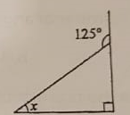
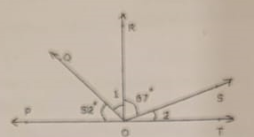

# Question Paper

**Delhi Public School**
**Gurugram I Sector 67A**

**HALF YEARLY ASSESSMENT**
**SESSION: 2024-25**

**NAME:**
**CLASS: VII**
**ROLL NO:**

**DATE: 17th September, 2024**
**SUBJECT: Mathematics**
**M.M: 80**
**DURATION: 3 hrs**

**INSTRUCTIONS:**

* Read the question paper carefully.
* All the questions are mandatory.
* This question paper consists of 33 questions and 5 printed pages.
* Number your answers correctly according to the questions.
* Do not write any information on the question paper.

## Section A (10 Marks)

**Q.1**
The value of 1.3 × 3.1 is
* a. 4.03
* b. 0.403
* c. 4.0339
* d. 0.0403

**Q.2**
The number of angles formed, when two lines intersect, is
* a. 5
* b. 4
* c. 2
* d. 6

**Q.3**
What is the product of the largest and the smallest fraction from the following list?

9/11
3/11
7/11
5/11
10/11
6/11
Options:

* a. 18/121
* b. 30/121
* c. 35/121
* d. 90/121

**Q.4**
The solution of the equation \(3x+4=25\) is
* a. 7
* b. 8
* c. 9
* d. 6

**Q.5**
Find the fraction of 3 km to 300 m.
Options:
* a. 1/100
* b. 10/1
* c. 1/10
* d. 100/1

**Q.6**
\(-5+9+(-5)+(-10)+(7)\) is equal to
* a. 13
* b. -13
* c. 10
* d. -10

**Q.7**
In the adjoining figure, if AB = PQ and BC = CQ, then find the measure of angle CPQ.

* a. 30°
* b. 90°
* c. 80°
* d. 60°

**Q.8**
Mean of 11, 10, 12, 12, 9, 10, 14, 12, 9 is
* a. 20
* b. 10
* c. 14
* d. 11

**Q.9**
An expression remains the same, when the expressions on the left and on the right are interchanged.
* a. Expression
* b. Equation
* c. Variable
* d. Constant

**Q.10**
Number of acute angles in the following figure is
* a. 3
* b. 1
* c. 4
* d. 2

## Section B (12 Marks)

**Q.11**
Find the value of x in the adjacent figure and state the property that is used to find the value.
[Image of a triangle with angles 125, 25, and x]
* a. 30°
* b. 60°
* c. 45°
* d. 50°

**Q.12**
If 28 trousers of equal size can be made from 63 m of cloth, what length of cloth is required for one trouser?

**Q.13**
Calculate the mean of the first five prime numbers.

**Q.14**
If (2x-1)/3=(x+2)/2, then what is the value of x?

**Q.15**
Calculate median and mode for the following data:
23, 45, 46, 12, 34, 87, 78, 12, 65, 33, 19, 34, 55, 67, 81, 12, 56, 98, 11, 49, 50

**Q.16**
Raju owns a plot which is 1 1/3 acre in size. If the value of land in his area is ₹48,000 per acre, what is the value of his plot?

## Section C (30 Marks)

**Q.17**
In a family, the consumption of wheat is 4 times that of rice. The total consumption of the two cereals is 80 kg. Find the quantities of rice and wheat consumed in the family.

**Q.18**
The given data is arranged in ascending order. The sum of mode and median of the given data is 15. Find the value of y.
\(y-1, y-1, y+1, y+4, 2y+1, 3y, 4y\)

**Q.19**
In the given adjacent figure, △QPR is a right-angled triangle with angle QPR = 70°.
* i) Find the value of y
* ii) Find the value of x
* iii) Find the value of z

**Q.20**
A square and an equilateral triangle have a side in common. If the side of the triangle is 4/3 cm long, find the perimeter of the adjacent figure.

**Q.21**
In the given adjacent figure, EV, FK, and GS are the medians of the triangle EFG. Find the value of:
* i) FS
* ii) KG
* iii) FV

**Q.22**
A shopkeeper earns a profit of ₹1 by selling one pen and incurs a loss of 40 paise per pencil while selling pencils of her old stock. In a particular month, she incurs a loss of ₹5. In this period, she sold 45 pens. How many pencils did she sell in this period?

**Q.23**
A car covers a distance of 89.1 km in 2.2 hours. What is the average distance covered by it in 1 hour?

**Q.24**
"5 added to three-fifth of a number gives 14/3".
* i) Write the equation for the above statement.
* ii) Solve the equation and find the number.

**Q.25**
In a class test containing 15 questions, 4 marks are given for every correct answer and (-2) marks are given for every incorrect answer.
* i) Gurpreet attempts all questions but only 9 of her answers are correct. What is her total score?
* ii) One of her friends attempted all questions and got only 5 answers correct. What will be her score?

**Q.26**
If RO is perpendicular to PT in the adjacent figure, find the measure of angle 1 and angle 2.

## Section D (28 Marks)

**Q.27**
Simplify and reduce to standard form:

**Q.28**
The data given below shows the production of motor bikes in a factory for some months of two consecutive years.

| Months   | 2023 | 2024 |
|----------|------|------|
| February | 2700 | 2800 |
| May      | 3200 | 4500 |
| August   | 6000 | 4800 |
| October  | 5000 | 4800 |
| December | 4200 | 5200 |

* i) Draw a double bar graph using appropriate scale to depict the above information.
* ii) In which year was the total output the maximum?

**Q.29**
The foot of a ladder is 6 m away from a wall, and its top reaches 8 m above the ground.
* i) Find the length of the ladder.
* ii) If the ladder is shifted in such a way that its foot is 8 m away from the wall, to what height does its top reach?

**Q.30**
* i) Raju's father's age is 5 years more than three times Raju's age. Find Raju's age, if his father is 44 years old.
* ii) Find a number, such that one-fourth of the number is 3 more than 7.

**Q.31**

There are four containers that are arranged in the ascending order of their heights. If the height of the smallest container given in the below figure is expressed as 7/25 x = 10.5 cm, find the height of the largest container (x).
[Image of four containers arranged in ascending order of height]

**Q.32**

Find the value of x in the adjacent figure.
[Image of a triangle with sides 3x, 2x+10, and x]

**Q.33**
A tree is broken at a height of 5 m from the ground, and its top touches the ground at a distance of 12 m from the base of the tree. Find the original height of the tree.

