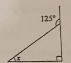
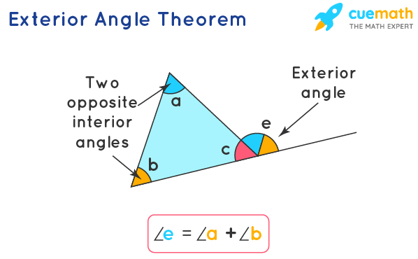
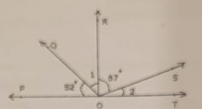
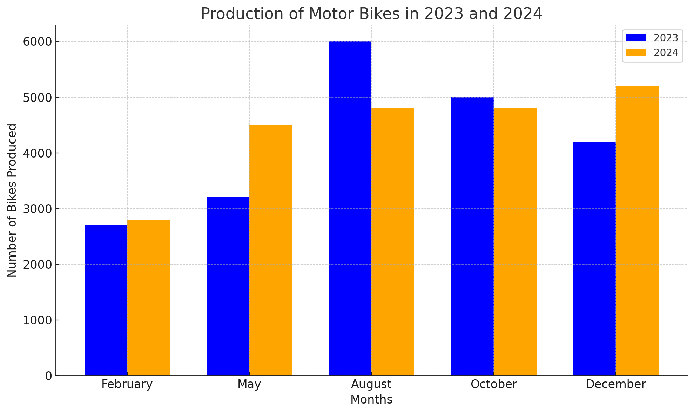
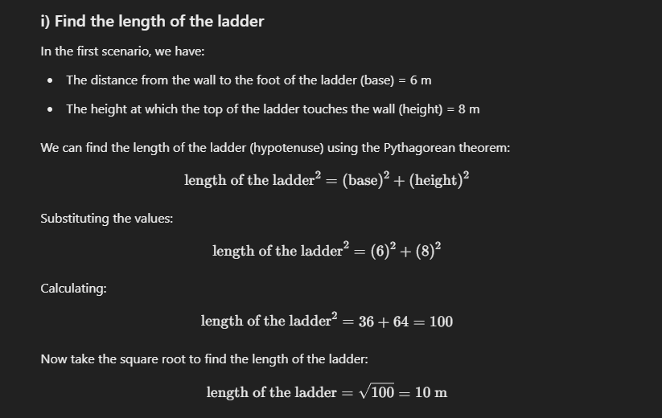
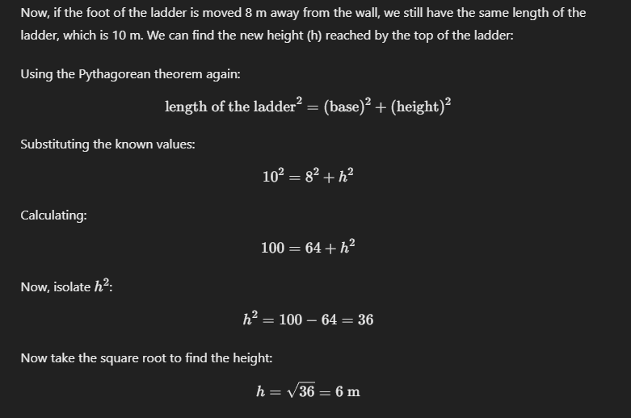
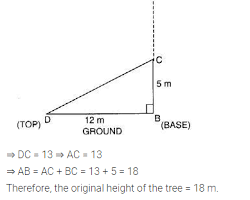

## Solutions to the Math Exam Questions

### Q.1
**Question:** The value of 1.3 × 3.1 is
**Solution:**
* Multiply the numbers as if they were whole numbers, ignoring the decimal points: 13 × 31 = 403.
* Count the total number of decimal places in both factors: 1.3 has 1 decimal place, and 3.1 has 1 decimal place, making a total of 2 decimal places.
* Place the decimal point in the product, starting from the right end and moving 2 places to the left: 403 becomes 4.03.

Therefore, the value of 1.3 × 3.1 is **4.03**.

### Q.2
**Question:** The number of angles formed, when two lines intersect, is
**Solution:**
When two lines intersect, they form four angles around the point of intersection. These angles are created by the two lines dividing the plane into four quadrants.

Therefore, the number of angles formed is **4**.

### Q.3
**Question:** What is the product of the largest and the smallest fraction from the following list?
[9\11 ,3\11, 7\11, 5\11, 10\11, 6\11]
**Solution:**
* First, identify the largest and smallest fractions. Since all fractions have the same denominator, we can compare their numerators. The largest numerator is 10, and the smallest numerator is 3.
* So, the largest fraction is (10\11) and the smallest fraction is (3\11).
* Now, multiply the two fractions: (10/11 times 3/11 = 10 times 3/11 times 11 = 30/121).

Therefore, the product of the largest and the smallest fraction is 30/121.

### Q.4
**Question:** The solution of the equation \(3x+4=25\) is
**Solution:**
* To solve the equation, we need to isolate the variable, x.
* Subtract 4 from both sides of the equation: \(3x+4-4=25-4\)
* This simplifies to \(3x=21\).
* Divide both sides by 3: (3x/3=21/3)
* This simplifies to \(x=7\).

Therefore, the solution of the equation is **7**.

### Q.5
**Question:** Find the fraction of 3 km to 300 m.
**Solution:**
* First, convert both measurements to the same unit. Since 1 km is equal to 1000 m, 3 km is equal to 3000 m.
* Now, write the fraction: 3000\300
* Simplify the fraction by dividing both the numerator and denominator by their greatest common divisor, which is 300: (3000\300)\(300\300) = (10\1)

Therefore, the fraction of 3 km to 300 m is **10\1** or simply **10**.

### Q.6
**Question:** -5+9+(-5)+(-10)+(7) is equal to
**Solution:**
* Combine the numbers:
  * \(-5+9=4\)
  * \(4+(-5)=-1\)
  * \(-1+(-10)=-11\)
  * \(-11+7=-4\)

Therefore, \(-5+9+(-5)+(-10)+(7)\) is equal to **-10**.
## Solutions to the Math Exam Questions (Section B)

### Q.7
**Question:** In the adjoining figure, if AB = PQ and BC = CQ, then find the measure of angle CPQ.
**Solution:**
* Given that AB = PQ and BC = CQ, we can conclude that triangles ABC and PQC are congruent by the Side-Side-Side (SSS) congruence criterion.
* Since corresponding angles of congruent triangles are equal, angle CPQ is equal to angle ABC.
* From the figure, angle ABC appears to be a right angle, which is 90 degrees.

Therefore, the measure of angle CPQ is **90 degrees**.

### Q.8
**Question:** Mean of 11, 10, 12, 12, 9, 10, 14, 12, 9 is
**Solution:**
* To find the mean, add all the numbers and divide by the total number of numbers.
* Sum of the numbers: 11 + 10 + 12 + 12 + 9 + 10 + 14 + 12 + 9 = 99
* Number of numbers: 9
* Mean: 99 / 9 = 11

Therefore, the mean of the given numbers is **12.11**.

### Q.9
**Question:** An expression remains the same, when the expressions on the left and on the right are interchanged.
**Solution:**
* An equation is a mathematical statement that shows that two expressions are equal.
* When the expressions on the left and right of an equation are interchanged, the equation remains true.

An **equation** is a statement that asserts the equality of two expressions. For instance, consider the equation:
3 + 4 = 7

If we interchange the expressions on the left and right sides of the equation, we get:
7 = 3 + 4

Both forms of the equation are true because they represent the same relationship. The equality holds regardless of the order of the expressions.

Here's another example:
2x + 5 = 11

If we solve for \(x\), we get:
2x = 11 - 5
2x = 6
x = 3

Now, if we interchange the left and right sides of the original equation, we get:
11 = 2x + 5

This is still true when \(x = 3\):
11 = 2(3) + 5
11 = 6 + 5
11 = 11

So, the equation remains valid even when the expressions on the left and right are swapped.

Therefore, the answer is **Equation**.

### Q.10
**Question:** Number of acute angles in the following figure is
**Solution:**
* An acute angle is an angle that measures less than 90 degrees.
* From the figure  all angles appear to be less than 90 degrees.
* Count the angles: 1, 2, 3

Therefore, the number of acute angles is **3**.

### Q.11



In the given image, we have a right triangle with one of the angles labeled as 125∘  (an exterior angle**, another angle as x, and a right angle 90∘ inside the triangle.

**Step 1: Use the Exterior Angle Property***
The exterior angle property of a triangle states that the exterior angle is equal to the sum of the two non-adjacent interior angles. In this case, the exterior angle is
125∘  and the two non-adjacent interior angles are x and 90∘ .
Thus, using the exterior angle property: 
```
125∘ = x + 90∘
```

**Step 2: Solve for x**
```
𝑥=125∘−90∘
𝑥=35∘
```

**Step 3: State the Property Used**
The property used is the exterior angle property of a triangle, which states that the exterior angle is equal to the sum of the two non-adjacent interior angles.

**Final Answer**
The value of **𝑥=35∘**, and the property used is the exterior angle property.

#### exterior angle property.
**Definition** :
The **exterior angle** of a triangle is formed when one side of the triangle is extended.
The angle formed outside the triangle, adjacent to the vertex of the triangle, is the exterior angle.

For any triangle, the exterior angle is equal to the sum of the two **non-adjacent interior angles** (the angles that are not adjacent to the exterior angle).



```
We can verify the exterior angle theorem with the known properties of a triangle. Consider a Δ ABC.

The three angles a + b + c = 180 (angle sum property of a triangle) ----- Equation 1

c= 180 - (a+b) ----- Equation 2 (rewriting equation 1)

e = 180 - c----- Equation 3 (linear pair of angles)

Substituting the value of c in equation 3, we get

e = 180 - [180 - (a + b)]

e = 180 - 180 + (a + b)

e = a + b

Hence verified.
```

### Q.12
**Question:** If 28 trousers of equal size can be made from 63 m of cloth, what length of cloth is required for one trouser?
**Solution:**
* Divide the total length of cloth by the number of trousers: 63 m / 28 = 2.25 m

Therefore, the length of cloth required for one trouser is **2.25 meters**.

### Q.13
**Question:** Calculate the mean of the first five prime numbers.
**Solution:**
* The first five prime numbers are 2, 3, 5, 7, and 11.
* Sum of the numbers: 2 + 3 + 5 + 7 + 11 = 28
* Number of numbers: 5
* Mean: 28 / 5 = 5.6

Therefore, the mean of the first five prime numbers is **5.6**.

### Q.14
**Question:** If (2x-1)/3=(x+2)/2, then what is the value of x?
**Solution:**
To solve the equation:
```
(2x - 1) / 3 = (x + 2) / 2
```
**Step 1: Eliminate the denominators by multiplying both sides by 6**  (the least common multiple of 3 and 2):

```
6 * [(2x - 1) / 3] = 6 *  [(x + 2) / 2]
```

This simplifies to:

```
2(2x - 1) = 3(x + 2)
```

**Step 2: Expand both sides**:

```
4x - 2 = 3x + 6
```

**Step 3: Bring all the terms with \(x\) on one side and constants on the other side**:

```
4x - 3x = 6 + 2
```

This simplifies to:

```
x = 8
```

Therefore, the value of x is **8**.

### Q.15
**Question:** Calculate median and mode for the following data:
23, 45, 46, 12, 34, 87, 78, 12, 65, 33, 19, 34, 55, 67, 81, 12, 56, 98, 11, 49, 50
**Solution:**
Let's calculate the **median** and **mode** for the given data set:

Data:
23, 45, 46, 12, 34, 87, 78, 12, 65, 33, 19, 34, 55, 67, 81, 12, 56, 98, 11, 49, 50

---
**Step 1: Arrange the data in ascending order**

11, 12, 12, 12, 19, 23, 33, 34, 34, 45, 46, 49, 50, 55, 56, 65, 67, 78, 81, 87, 98

---

**Median Calculation:**

To find the **median**, we need to determine the middle value in this ordered data.

- The total number of observations is 21 (an odd number).
- The middle value is the \((21+1)/2 = 11\)th value.

So, the 11th value in the ordered list is **46**.

Thus, the **median** is **46**.

---

**Mode Calculation:**

The **mode** is the number that appears most frequently in the data set.

In the ordered list:
- 12 appears **3 times**.
- 34 appears **2 times**.

The most frequent value is **12**.

Thus, the **mode** is **12**. 

---

**Final Answer:**
- **Median** = 46
- **Mode** = 12

### Q.16
**Question:** Raju owns a plot which is 1 1/3 acre in size. If the value of land in his area is ₹48,000 per acre, what is the value of his plot?
**Solution:**
To calculate the value of Raju's plot, you can follow these steps:

1. **Convert 1 1/3 acres to a decimal:**
   - 1 1/3 acres = 1 + 1/3 = 1.3333 acres.

2. **Multiply the plot size by the value per acre:**
   Value of the plot = 1.3333 acres * 48,000₹/acre
   Value of the plot= 64,000 ₹

So, the value of Raju's plot is ₹64,000.


### Q.17
**Question:** In a family, the consumption of wheat is 4 times that of rice. The total consumption of the two cereals is 80 kg. Find the quantities of rice and wheat consumed in the family.
**Solution:**
* Let the consumption of rice be x kg.
* Then, the consumption of wheat is 4x kg.
* Total consumption: x + 4x = 5x kg
* Given that total consumption is 80 kg: 5x = 80
* Solving for x: x = 16
* So, consumption of rice is 16 kg and consumption of wheat is 4 * 16 = 64 kg.

Therefore, the family consumed **16 kg of rice** and **64 kg of wheat**.
## Solutions to the Math Exam Questions (Section C)

### Q.18
**Question:** The given data is arranged in ascending order. The sum of mode and median of the given data is 15. Find the value of y.
y-1, y-1, y+1, y+4, 2y+1, 3y, 4y
**Solution:**

Let's break this down step by step.

Given Data in Ascending Order:
[ y-1,  y-1,  y+1,  y+4,  2y+1,  3y,  4y ]

We are asked to find the value of \( y \), given that the sum of the mode and the median is 15.

---

**Step 1: Find the Mode**
- The **mode** is the value that appears most frequently in the data set.
- In the given data, ( y-1 ) appears twice, while all other values appear only once.
- So, the mode is ( y-1 ).

---

**Step 2: Find the Median**
- The **median** is the middle value in an ordered data set.
- Since there are 7 numbers, the median will be the 4th number in the ordered set.

So, the median is ( y+4 ).

---

**Step 3: Equation Setup**
We are told that the sum of the mode and the median is 15. So, we can set up the equation as:
Mode + Median = 15
(y-1) + (y+4) = 15

Step 4: Solve for \( y \)
Simplify the equation:
2y + 3 = 15
Subtract 3 from both sides:
2y = 12
Divide by 2:
y = 6

---

**Final Answer:**
The value of ( y ) is **6**.

### Q.19
**Question:** In the given adjacent figure, △QPR is a right-angled triangle with angle QPR = 70°.
* i) Find the value of y
* ii) Find the value of x
* iii) Find the value of z
**Solution:**
Let’s break this down in steps using the diagram and the concept of exterior and interior angles.

**Given:**
- triangle QPR  is a right-angled triangle.
- angle QPR = 70  (given).
- angle QRP = 90  because  PR perpendicular to  RS .

---

**Step 1: Find ( y )**
In triangle QPR , the sum of the interior angles must be  180 . Since angle QRP = 90  and angle QPR = 70 , the third angle  y  is:

angle PQR = 180 - (90 + 70) = 180 - 160 = 20

So,  y = 20 .

---

**Step 2: Find ( x ) (Exterior Angle)**
 angle x  is the exterior angle at vertex  T , adjacent to  triangle QRT .
 According to the **Exterior Angle Theorem***, the exterior angle is equal to the sum of the two non-adjacent interior angles of the triangle.

Here:
- angle QRP = 90  (from  PR perpendicular to RS ).
- angle QPR = 70  (given).

So, the exterior angle ( x ) is:
x = 90 + 70 = 160

Thus, x = 160 .

---

**Step 3: Find ( z )**

Finally, z is an angle on a straight line with x (i.e., z and x form a linear pair, summing to 180 ).

Therefore, to find z , we subtract x from 180:
z = 180 - x = 180 - 160 = 20

Thus, z = 20 .

---

**Final Values:**
-  y = 20
-  x = 160
-  z = 20

Everything is consistent and follows from the Exterior Angle Theorem and basic properties of angles in triangles.

### Q.20
**Question:** A square and an equilateral triangle have a side in common. If the side of the triangle is 4\3 cm long, find the perimeter of the adjacent figure.
**Solution:**


The perimeter of a geometric shape, such as a triangle or a square, is the total length of all its sides.

### For a Triangle:
The perimeter is the sum of the lengths of its three sides. If a triangle has sides of lengths a, b, and c, then the perimeter P is given by:
 P = a + b + c 

### For a Square:
The perimeter is the sum of the lengths of its four equal sides. If each side of the square has length s, then the perimeter P is given by:
 P = 4 x sides

In simple terms, the perimeter is the distance you would travel if you walked all the way around the shape once.


### Given:
- The side of the equilateral triangle is 4/3 cm.

### Solution:
1. **Identify the sides:**
   - Since the triangle is equilateral, all three sides are 4/3 cm.
   - The square shares one side with the triangle, so each side of the square is also 4/3 cm.

2. **Calculate the perimeter:**
   - The perimeter of the equilateral triangle is:
     3 x 4/3 = 4 cm
   - The perimeter of the square is:
     4 x 4/3 = 16/3 cm

3. **Combine the perimeters:**
   - Since one side is shared, we need to subtract this common side once from the total perimeter:
     Total Perimeter = 4 cm + 16/3 cm - 4/3 cm
     Total Perimeter = 4 + 12/3
     Total Perimeter = 4 + 4
     Total Perimeter = 8 cm

So, the perimeter of the adjacent figure is 8 cm.

### Q.21
**Question:** In the given adjacent figure, EV, FK, and GS are the medians of the triangle EFG. Find the value of:
* i) FS
* ii) KG
* iii) FV
**Solution:**

**Understanding the Medians**

Before we calculate the values, let's clarify what a median in a triangle is:

* A median of a triangle is a line segment that connects a vertex to the midpoint of the opposite side.
* In this case, EV, FK, and GS are medians, meaning they divide the opposite sides into two equal halves.

**Analyzing the Given Information**

From the figure, we can infer the following:
* **EV** is the median from vertex E to side FG, dividing FG into two equal parts.
* **FK** is the median from vertex F to side EG, dividing EG into two equal parts.
* **GS** is the median from vertex G to side EF, dividing EF into two equal parts.

**Given lengths:**
* FG = 10 cm
* EG = 12 cm
* EF = 7 cm

**Calculations**

* **i) FS:**
  * Since GS is a median, it divides EF into two equal parts.
  * FS = \(\frac{1}{2}\)EF = \(\frac{1}{2}\) * 7 cm = **3.5 cm**

* **ii) KG:**
  * Since FK is a median, it divides EG into two equal parts.
  * KG = \(\frac{1}{2}\)EG = \(\frac{1}{2}\) * 12 cm = **6 cm**

* **iii) FV:**
  * Since EV is a median, it divides FG into two equal parts.
  * FV = \(\frac{1}{2}\)FG = \(\frac{1}{2}\) * 10 cm = **5 cm**

**Therefore, the values are:**

* FS = 3.5 cm
* KG = 6 cm
* FV = 5 cm

### Q.22
**Question:** A shopkeeper earns a profit of ₹1 by selling one pen and incurs a loss of 40 paise per pencil while selling pencils of her old stock. In a particular month, she incurs a loss of ₹5. In this period, she sold 45 pens. How many pencils did she sell in this period?
**Solution:**
#### Step-by-step solution:

1. **Convert all values to paise**:
   - ₹1 = 100 paise
   - 40 paise remains as is.
   - ₹5 = 500 paise

2. **Let's assume** the number of pencils sold is denoted by  x .

3. **Profit from selling pens**:
   - The shopkeeper earns 100 paise (₹1) for each pen.
   - She sold 45 pens.
   - So, total profit from pens =  45 * 100 = 4500  paise.

4. **Loss from selling pencils**:
   - The shopkeeper loses 40 paise for each pencil sold.
   - If she sold x pencils, the total loss from pencils = 40 * x  paise.

5. **Total loss in the month**:
   - The shopkeeper has a total loss of ₹5, which is 500 paise.
   - We know the profit from pens and the loss from pencils together result in a total loss of 500 paise.
   - So, the equation becomes:
     4500 paise (from pens)- 40x paise (from pencils)= -500 paise (total loss)

6. **Solve the equation**:
   4500 - 40x = -500
   4500 + 500 = 40x
   5000 = 40x
   x = 5000/40 = 125

#### Final Answer:
The shopkeeper sold 125 pencils during that period.

### Q.23
**Question:** A car covers a distance of 89.1 km in 2.2 hours. What is the average distance covered by it in 1 hour?
**Solution:**

We first convert everything into the smallest units. The question involves kilometers and hours, so we'll convert:

```
89.1 km = 89.1 * 1000 = 89,100 meters
2.2 hours = 2.2 * 60 = 132 minutes
```

We need to find the distance covered in 1 hour = 60 minutes

**Step-by-Step Explanation:**

We will set up the relation:

```
89,100 meters / 132 minutes = x meters / 60 minutes
```

Now, use cross multiplication to solve for x (the distance covered in 1 hour).

```
Cross Multiplication: 89,100 meters * 60 minutes = x meters * 132 minutes
```

Now, perform the multiplication:

```
89,100 * 60 = 5,346,000
```

This gives:

```
5,346,000 = x * 132
```

Now, divide both sides by 132 to solve for x:

```
x = 5,346,000 / 132
```

When you perform this division:

```
x = 40,500 meters
```

Now, convert back to kilometers:

```
40,500 meters = 40.5 km
```

Thus, the car covers 40.5 km in 1 hour.

**Visual Representation (in text format):**

Write the known distance and time as a ratio:

```
89,100 meters / 132 minutes = x meters / 60 minutes
```

Cross multiply the terms:

```
89,100 * 60 = x * 132
```

Solve for x:

```
x = 5,346,000 / 132 = 40,500 meters
```

Convert the result back to kilometers:

```
40,500 meters = 40.5 km
```

This approach helps visualize how the relationship between different units works when solving distance, speed, or time problems.

### Q.24
**Question:** "5 added to three-fifth of a number gives 14\3".
* i) Write the equation for the above statement.
* ii) Solve the equation and find the number.
**Solution:**
**i) Writing the equation:**

"5 added to three-fifth of a number gives 14/3" means we need to first express "three-fifth of a number."

Let the unknown number be represented by x.

Three-fifth of the number is written as: (3/5) * x.

Now, add 5 to this, so the expression becomes: (3/5) * x + 5.

This is equal to 14/3.

So, the equation is:

    (3/5) * x + 5 = 14/3.

**ii) Solving the equation:**

Start with the equation:

    (3/5) * x + 5 = 14/3.

Subtract 5 from both sides to isolate the fraction with x:

    (3/5) * x = 14/3 - 5.

Convert 5 into a fraction with a denominator of 3 to make subtraction easier:

5 = 15/3, so now the equation becomes:

    (3/5) * x = 14/3 - 15/3.

Perform the subtraction on the right-hand side:

    14/3 - 15/3 = -1/3.

So, now we have:

    (3/5) * x = -1/3.

To solve for x, multiply both sides by the reciprocal of (3/5), which is (5/3):

    x = (-1/3) * (5/3).

Multiply the fractions:

    x = -5/9.

**Final Answer:**

The number is -5/9.

## Solutions to the Math Exam Questions (Section D)

### Q.25
**Question:** In a class test containing 15 questions, 4 marks are given for every correct answer and (-2) marks are given for every incorrect answer.
* i) Gurpreet attempts all questions but only 9 of her answers are correct. What is her total score?
* ii) One of her friends attempted all questions and got only 5 answers correct. What will be her score?
**Solution:**
* i) Gurpreet's total score:
  Gurpreet attempted all 15 questions, and she got 9 correct answers.
  For each correct answer, she gets 4 marks, and for each incorrect answer, she loses 2 marks.
  * First, calculate the marks she gets for the correct answers:
    For 9 correct answers, the marks are: 9 * 4 = 36 marks.
  * Now, calculate the number of incorrect answers:
    Gurpreet attempted 15 questions in total. So, the number of incorrect answers is: 15 - 9 = 6.
  * Next, calculate the marks deducted for the incorrect answers:
    For 6 incorrect answers, the marks deducted are: 6 * -2 = -12 marks.
  * Finally, calculate her total score:
    Total score = Marks from correct answers + Marks deducted from incorrect answers 36 + (-12) = 36 - 12 = 24.
  So, Gurpreet's total score is 24.

* ii) Her friend's total score:
  Her friend attempted all 15 questions, and she got 5 correct answers.
  * First, calculate the marks she gets for the correct answers:
    For 5 correct answers, the marks are: 5 * 4 = 20 marks.
  * Now, calculate the number of incorrect answers:
    Her friend attempted 15 questions in total. So, the number of incorrect answers is: 15 - 5 = 10.
  * Next, calculate the marks deducted for the incorrect answers:
    For 10 incorrect answers, the marks deducted are: 10 * -2 = -20 marks.
  * Finally, calculate her total score:
    Total score = Marks from correct answers + Marks deducted from incorrect answers 20 + (-20) = 20 - 20 = 0.
  So, her friend's total score is 0.

### Q.26
**Question:** If RO is perpendicular to PT in the adjacent figure, find the measure of angle 1 and angle 2.

**Solution:**
Given that RO is perpendicular to PT, we know that the angles formed at point O are right angles.

In the figure, we have:
Angle ROP is 90 degrees.
Angle 1 is given as 67 degrees.
To find angle 2, we can use the fact that the sum of angles around a point is 360 degrees:
Calculate angle 2: Angle 2 + Angle 1 = 90 degrees Angle 2 + 67 degrees = 90 degrees Angle 2 = 90 degrees - 67 degrees = 23 degrees

Thus, we have:
Angle 1 = 67 degrees
Angle 2 = 23 degrees

### Q.27

**Question:** Simplify and reduce to standard form:
I)  −15/35∗((27/−63)/(81/14))
II) ((-2/-72 ) + (4/9)) + (-6/14)
#### Solution:

##### Expression:
−15/35∗((27/−63)/(81/14))

**Simplify 27/−63:**

    27÷9/−63÷9
    =3/−7=−3/7

**Simplify 81/14:**
It's already in its simplest form.

**Divide the fractions inside the parentheses:**

    −3/7÷81/14
    = −3/7∗14/81
    = (−3∗14)/(7∗81)=−42/567

**Simplify −42/567:**

    −42÷21/567÷21
    =−2/27

**Multiply the remaining fractions:**

    −15/35∗−2/27

**Simplify −15/35:**

    −15÷5/35÷5
    =−3/7

**Perform the multiplication:**

    −3/7∗−2/27
    =(−3∗−2)/(7∗27)
    =6/189

**Simplify 6/189:**

    6÷3/189÷3
    =2/63

The simplified form is 2/63.

##### Expression:

    ((-2/-72 ) + (4/9)) + (-6/14)

**Simplify −2/−72:**

    −2÷−2/−72÷−2
    =1/36

**Add the fractions inside the parentheses:**

    (1/36)+(4/9)

**Find a common denominator (which is 36):**

    (4∗4)/(9∗4)
    =16/361/36+16/36
    =(1+16)/36
    =17/36

**Now, add the remaining fraction:**

    (17/36)+(−6/14)

**Find a common denominator (which is 252):**

    17∗7/36∗7
    =119/252−6∗18/14∗18
    =−108/252119/252+(−108/252)
    =(119−108)/252
    =11/252

The simplified form is 11/252.

### Q.28
**Question:** The data given below shows the production of motor bikes in a factory for some months of two consecutive years.

| Months   | 2023 | 2024 |
|----------|------|------|
| February | 2700 | 2800 |
| May      | 3200 | 4500 |
| August   | 6000 | 4800 |
| October  | 5000 | 4800 |
| December | 4200 | 5200 |

* i) Draw a double bar graph using appropriate scale to depict the above information.
* ii) In which year was the total output the maximum?
**Solution:**
### i) Double Bar Graph

Here is the double bar graph depicting the production of motor bikes in 2023 and 2024:



### ii) Year with Maximum Total Output

To find out in which year the total output was the maximum, let's calculate the total production for each year:

**Total production for 2023:**
- February : 2700
- May      : 3200
- August   : 6000
- October  : 5000
- December : 4200

**Total for 2023 = 2700 + 3200 + 6000 + 5000 + 4200 = 21100**

**Total production for 2024:**
- February : 2800
- May      : 4500
- August   : 4800
- October  : 4800
- December : 5200

**Total for 2024 = 2800 + 4500 + 4800 + 4800 + 5200 = 22100**

### Conclusion
The total output was maximum in **2024**, with a total production of **22100 bikes**, compared to **21100 bikes** in 2023.

## Solutions to the Math Exam Questions (Section D)

### Q.29
**Question:** The foot of a ladder is 6 m away from a wall, and its top reaches 8 m above the ground.
* i) Find the length of the ladder.
* ii) If the ladder is shifted in such a way that its foot is 8 m away from the wall, to what height does its top reach?
**Solution:**
* **i) Length of the ladder:**
  * We have a right triangle where the ladder is the hypotenuse, the distance from the wall is the base, and the height is the perpendicular.
  * Using the Pythagorean theorem: a² + b² = c²
  * Substitute the values: 6² + 8² = c²
  * Simplify: 36 + 64 = c²
  * c² = 100
  * c = √100 = 10 meters
* **ii) New height:**
  * Again, use the Pythagorean theorem: 8² + b² = 10²
  * Simplify: 64 + b² = 100
  * b² = 100 - 64 = 36
  * b = √36 = 6 meters

Therefore, the length of the ladder is **10 meters** and the new height it reaches is **6 meters**.


#### Pythagorean theorem
The Pythagorean theorem is a fundamental principle in geometry that relates to right triangles.
It states that in a right triangle, the square of the length of the hypotenuse (the side opposite the right angle) is equal to the sum of the squares of the lengths of the other two sides.

##### The Formula
The theorem is expressed mathematically as:

c^2 = a^2 + b^2

Where:
- c is the length of the hypotenuse.
- a  and b are the lengths of the other two sides.

##### Diagram
Here’s a simple diagram illustrating the Pythagorean theorem:

```
          |\
          | \
       b  |  \ c
          |   \
          |____\
             a
```

##### Explanation
1. **Right Triangle**: The triangle shown has a right angle (90 degrees) between sides a and b .
2. **Hypotenuse**: The side c is the hypotenuse, which is the longest side of the triangle.
3. **Sides a and b **: The other two sides of the triangle are a and b .

##### Application
The Pythagorean theorem is used to calculate the length of one side of a right triangle when the lengths of the other two sides are known.


#### Solution:
##### Find the length of the ladder

To solve this problem, we can use the Pythagorean theorem, which relates the lengths of the sides of a right triangle.
```
        |\
        | \
        |  \
   8 m  |   \
        |    \
        |     \
        |______\
         6 m
```


##### Find the height when the ladder's foot is 8 m away from the wall

```
        |
        |\
        | \
        |  \
        |   \
   ? m  |    \  
        |     \
        |______\
          8 m

```


### Q.30
**Question:**
* i) Raju's father's age is 5 years more than three times Raju's age. Find Raju's age, if his father is 44 years old.
* ii) Find a number, such that one-fourth of the number is 3 more than 7.
**Solution:**
* **i) Raju's age:**
  * Let Raju's age be x.
  * Father's age: 3x + 5
  * Given: 3x + 5 = 44
  * Solve for x: 3x = 44 - 5 = 39
  * x = 39 / 3 = 13
* **ii) The number:**
  * Let the number be x.
  * Given: \(\frac{1}{4}x = 7 + 3\)
  * Solve for x: \(\frac{1}{4}x = 10\)
  * Multiply both sides by 4: x = 10 * 4 = 40

Therefore, Raju's age is **13 years** and the number is **40**.

### Q.31
**Question:** There are four containers that are arranged in the ascending order of their heights. If the height of the smallest container given in the below figure is expressed as 7/25 x = 10.5 cm, find the height of the largest container (x).

**Solution:**

To find the height of the largest container, we start with the given relationship:

    7/25 x = 10.5 cm

We need to solve for x :

Multiply both sides by 25 to isolate x:

    7x=10.5×25

Simplify the right-hand side:

    7x=262.5

Divide both sides by 7:

    x=262.57

Perform the division:

    x=37.5

So, the height of the largest container x is 37.5 cm.

### Q.32
**Question:** Find the value of x in the adjacent figure.

**Solution:**

**Identifying Angles**

* Let's denote the angle adjacent to 3x as angle 1.
* Let's denote the angle adjacent to (2x + 10) as angle 2.

**Observations:**

* Lines TZ and PV are parallel (indicated by the arrows).
* JK is a transversal intersecting these parallel lines.

**Properties of Parallel Lines and Transversals**

* When a transversal intersects two parallel lines, the alternate interior angles are congruent.

**Applying the Property**

* Angle 1 and (2x + 10) are alternate interior angles.
* Therefore, angle 1 = (2x + 10)

**Solving for x**

* We know that angle 1 and 3x are supplementary (they add up to 180 degrees) since they form a straight line.
* So, angle 1 + 3x = 180
* Substitute (2x + 10) for angle 1: (2x + 10) + 3x = 180
* Combine like terms: 5x + 10 = 180
* Subtract 10 from both sides: 5x = 170
* Divide both sides by 5: x = 34

**Therefore, the value of x is 34.**


### Q.33
**Question:** A tree is broken at a height of 5 m from the ground, and its top touches the ground at a distance of 12 m from the base of the tree. Find the original height of the tree.
**Solution:**


**In the diagram:**

* **AB:** Original height of the tree
* **BC:** Broken part of the tree (5 m)
* **AC:** Distance from the base to the point where the top touches the ground (12 m)

**Using the Pythagorean Theorem**

Since triangle ABC is a right-angled triangle (right angle at B), we can use the Pythagorean theorem:

* a² + b² = c²

where:
* a = BC = 5 m (height of the broken part)
* b = AC = 12 m (distance from the base to the top)
* c = AB = original height of the tree

**Substituting values:**

* 5² + 12² = c²
* 25 + 144 = c²
* 169 = c²

**Finding the original height:**

* c = √169 = 13 m

**Therefore, the original height of the tree was 5 m (broken part) + 13 m (remaining part) = 18 meters.**
