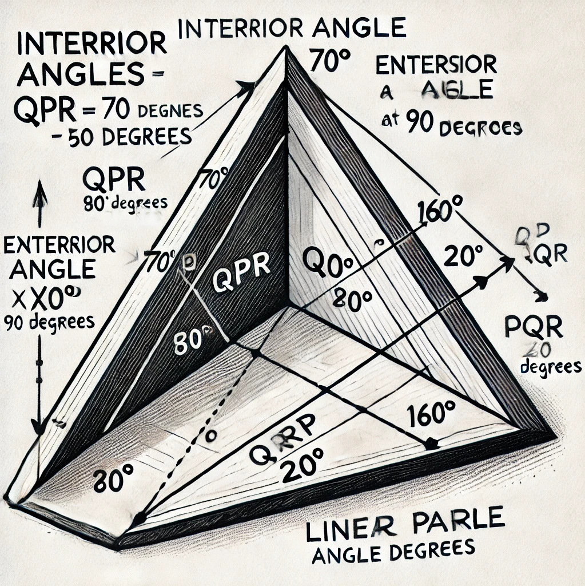
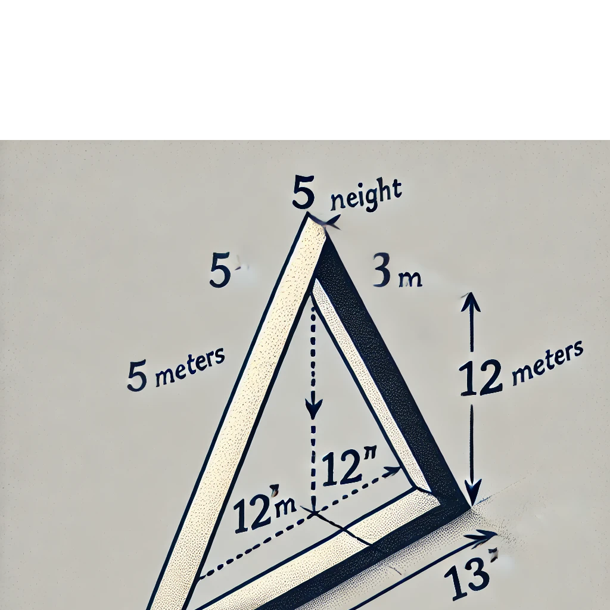
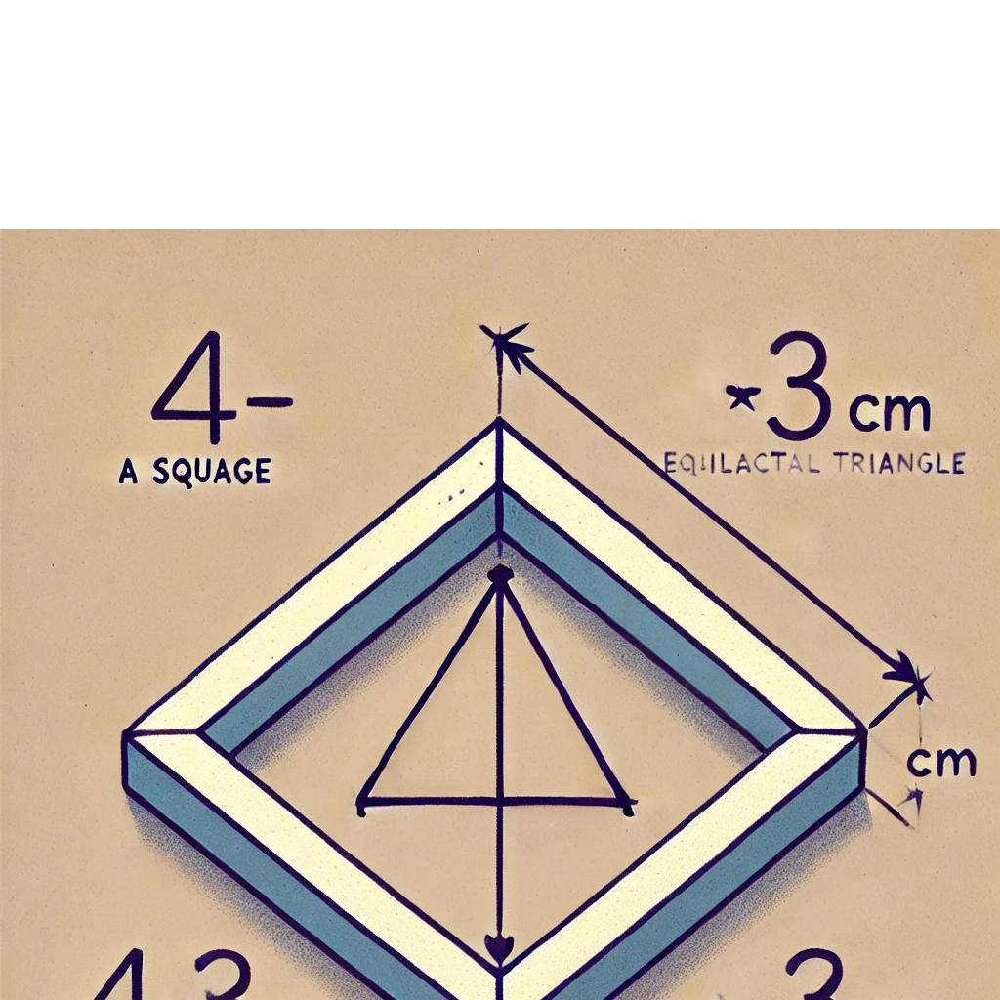

## 1. **Triangles and Angles**

### **Interior and Exterior Angles in Triangles**
- **Interior Angles**: The sum of the interior angles in any triangle is always 180 degrees.
  - **Example**: In triangle QPR, with angles QRP = 90 degrees and QPR = 70 degrees, the third angle is calculated as:
    - Third angle = 180 degrees - (90 degrees + 70 degrees) = 20 degrees.
  
- **Exterior Angle Theorem**: An exterior angle is equal to the sum of the two non-adjacent interior angles.
  - **Example**: The exterior angle \(x\) at vertex \(T\) is calculated as 90 degrees + 70 degrees = 160 degrees.
  - The corresponding angle on a straight line would be \(z\) = 180 degrees - 160 degrees = 20 degrees.

### **Congruence of Triangles**
- Two triangles are congruent if all corresponding sides and angles are equal (using rules like Side-Side-Side (SSS) or Side-Angle-Side (SAS)).
  - **Example**: Triangles ABC and PQC are congruent by the Side-Side-Side (SSS) criterion, so corresponding angles like angle CPQ are equal to 90 degrees.

## 2. **The Pythagorean Theorem**

The Pythagorean theorem applies to right-angled triangles, stating that the square of the longest side (hypotenuse) is equal to the sum of the squares of the other two sides:
- The formula is: \(c^2 = a^2 + b^2\), where \(c\) is the hypotenuse and \(a\) and \(b\) are the other two sides.
  
- **Example**: A tree broken 5 meters above the ground touches the ground 12 meters from its base. Using the theorem, the original height of the tree can be calculated:
  - \(5^2 + 12^2 = c^2\), which gives \(25 + 144 = 169\), so \(c = 13\) meters. Therefore, the total height is 5 + 13 = 18 meters.

## 3. **Perimeter and Area of Geometric Shapes**

- **Perimeter of Polygons**: The perimeter is the total length of all sides of a shape.
  - **Example**: For a square and an equilateral triangle sharing one side, where each side of the triangle is \( 4\3 \, cm\), the perimeter of the combined figure can be found by summing the sides, considering the shared side.

## 4. **Statistics**

### **Mean, Median, and Mode**
- **Mean**: The average of a set of numbers.
  - **Example**: Mean of the set {11, 10, 12, 12, 9, 10, 14, 12, 9}:
    - Mean = (sum of numbers) divided by (number of values) = 99 divided by 9 = 11.
  
- **Median**: The middle value in an ordered dataset.
  - **Example**: In a dataset with 21 values, the 11th value is the median.
  
- **Mode**: The value that appears most frequently.
  - **Example**: In a dataset where 12 appears three times, the mode is 12.

## 5. **Solving Linear Equations**

Linear equations represent a straight line when plotted on a graph. They are solved by isolating the variable.
- **Example 1**: Solving for Raju's age in the equation \(3x + 5 = 44\):
  - Subtract 5 from both sides to get \(3x = 39\), then divide by 3 to get \(x = 13\).
  
- **Example 2**: Solving for a number \(x\) where \( 1\4x = 10 \):
  - Multiply both sides by 4 to get \(x = 40\).

## 6. **Geometrical Properties of Shapes**

### **Medians in a Triangle**
A median is a line connecting a vertex of a triangle to the midpoint of the opposite side, dividing the side into two equal parts.
- **Example**: For a triangle with medians named EV, FK, and GS, the lengths can be found by dividing the corresponding sides into two equal parts.

## 7. **Special Cases: Profit and Loss**

Profit and loss problems can be solved using basic arithmetic.
- **Example**: A shopkeeper earns ₹1 per pen and loses 40 paise per pencil. After selling 45 pens and incurring a ₹5 loss, the number of pencils sold can be calculated using simple equations.

